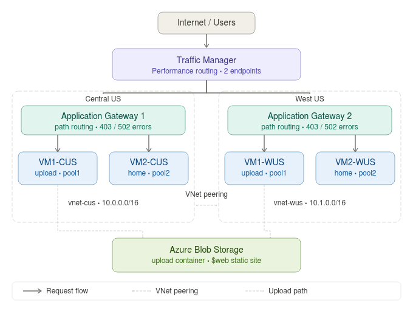

# Azure Multi-Region Infrastructure

A multi-region cloud infrastructure deployment on Microsoft Azure, built entirely through the Azure Portal. The focus of this project is the infrastructure design: how Traffic Manager, Application Gateways, VNets, and Blob Storage are wired together to deliver high availability, regional failover, and URL-based traffic routing across two geographic regions.

The workload (a three-page web application) exists to give the infrastructure something real to serve. The engineering decisions here are infrastructure decisions, not application decisions.

---

## Architecture



---

## Infrastructure at a Glance

| Component | Configuration |
|---|---|
| **Azure Traffic Manager** | Performance routing · 2 endpoints (one per region) · latency-based failover |
| **Application Gateway × 2** | Standard V2 · URL path-based routing · custom error pages (403 / 502) |
| **Virtual Machines × 4** | Ubuntu 24.04 LTS · 2 per region · dedicated roles per VM |
| **VNet × 2** | `vnet-cus` (10.0.0.0/16) · `vnet-wus` (10.1.0.0/16) · bidirectional VNet-VNet Peering |
| **Azure Blob Storage** | `upload` container (file storage) · `$web` container (static error page) |

---

## How a Request Flows Through the Infrastructure

```
User
 │
 ▼
Azure Traffic Manager  ──── Performance routing picks nearest healthy gateway
 │
 ├── Central US ──► Application Gateway 1 (ag1-cus)
 │                       │
 │                       ├── /upload  ──► pool1 ──► VM1-CUS (port 80)
 │                       ├── /        ──► pool2 ──► VM2-CUS (port 80)
 │                       └── 403/502  ──────────► Blob static site
 │
 └── West US ────► Application Gateway 2 (ag2-wus)
                         │
                         ├── /upload  ──► pool1 ──► VM1-WUS (port 80)
                         ├── /        ──► pool2 ──► VM2-WUS (port 80)
                         └── 403/502  ──────────► Blob static site
```

1. The user hits `azproject-tm.trafficmanager.net`
2. Traffic Manager measures latency to each Application Gateway and routes to the nearest one
3. The Application Gateway evaluates the URL path against its routing rules and forwards to the correct backend pool
4. If a backend is unreachable (502) or access is blocked (403), the gateway redirects to a custom error page hosted as a static website in Azure Blob Storage
5. Uploaded files from VM1 go directly to the `upload` container in Blob Storage

---

## Key Infrastructure Decisions

**Why two Application Gateways instead of one?**
A single gateway in one region would be a single point of failure. Running a gateway per region means if Central US degrades, Traffic Manager detects the unhealthy endpoint and routes 100% of traffic to West US with no manual intervention needed.

**Why does each Application Gateway need its own subnet?**
Azure requires Application Gateways to sit in a dedicated subnet; they cannot share with VMs. Mixing them causes deployment failures. Each VNet has a separate `/24` for the gateway (`subnet-ag-cus`, `subnet-ag-wus`) and another for the VMs.

**Why VNet-VNet Peering instead of public internet communication?**
Peering keeps cross-region VM traffic on the Azure backbone, giving lower latency, no public IP exposure, no data exfiltration risk. The two VNets use non-overlapping address spaces (`10.0.0.0/16` and `10.1.0.0/16`) which is a requirement for peering to work.

**Why Traffic Manager Performance routing instead of Weighted or Priority?**
Performance routing dynamically measures DNS resolution latency from the user's location to each endpoint and picks the fastest one. For a geographically distributed deployment this is the right choice: a user in Asia gets West US, a user in Europe gets the genuinely closer region.

**Why is the error page in Blob Storage instead of on the VMs?**
Custom error pages in Application Gateway must be hosted at a publicly accessible URL. Blob static sites provide exactly that: a stable HTTPS endpoint with no VM dependency. If both VMs in a region are down, the error page still loads because it comes from storage, not a VM.

---

## Application Gateway Routing Rules

Both gateways are configured identically. The routing logic is:

| URL Path | Backend Pool | Target | Port |
|---|---|---|---|
| `/upload` | pool1 | VM1 (upload node) | 80 |
| `/` · `/home` (default) | pool2 | VM2 (Apache2) | 80 |
| 403 Forbidden | N/A | Blob static site (`$web`) | 443 |
| 502 Bad Gateway | N/A | Blob static site (`$web`) | 443 |

Default backend target is pool2. The `/upload` path-based rule overrides the default for that prefix only.

---

## Virtual Machines

| VM | Region | VNet | Role | Runtime |
|---|---|---|---|---|
| `vm1cus` | Central US | `vnet-cus` | Upload node | Application on port 80 |
| `vm2cus` | Central US | `vnet-cus` | Home page | Apache2 on port 80 |
| `vm1wus` | West US | `vnet-wus` | Upload node | Application on port 80 |
| `vm2wus` | West US | `vnet-wus` | Home page | Apache2 on port 80 |

VM2 is intentionally minimal: Apache2 serving one static HTML file, nothing else. Keeping the roles separate means a failure in the upload application on VM1 does not affect the home page on VM2, and the gateway health probe for each pool monitors them independently.

---

## Networking

```
vnet-cus  (10.0.0.0/16)          vnet-wus  (10.1.0.0/16)
├── subnet-vms-cus  10.0.0.0/24  ├── subnet-vms-wus  10.1.0.0/24
└── subnet-ag-cus   10.0.1.0/24  └── subnet-ag-wus   10.1.1.0/24
         │                                   │
         └──────── VNet-VNet Peering ─────────┘
                   cus-to-wus / wus-to-cus
```

NSG rules on all VMs: inbound allow port 80 (HTTP) and port 22 (SSH). All other inbound traffic is denied by default.

---

## Blob Storage

| Container | Access Level | Purpose |
|---|---|---|
| `upload` | Blob-level public read | Stores user-uploaded files |
| `$web` | Static website (public) | Hosts `error.html` (custom 403/502 error page) |

The `$web` static site primary endpoint URL is pasted into both Application Gateways under **Custom error pages**. This URL is HTTPS, which is required: Application Gateway custom error page URLs must be HTTPS.

---

## Security Notes

- No credentials stored in code or configuration files; injected as OS environment variables at runtime on VM1 only
- VM2 (Apache) has no application credentials at all
- Storage account has anonymous access enabled at the individual container level only, not at the account level
- Application Gateway sits in front of all VM traffic; VMs have no direct public-facing role beyond SSH

